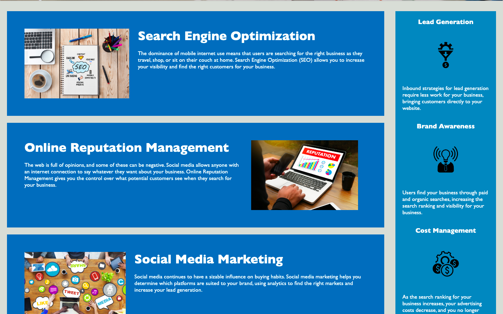

# Horiseon Source Code Refactorization

## Description
This project was to gain practice in refactoring source code to optimize it according to performance or guideline standards.  Refactorization can mean code is rewritten according to a standard or just simplified and made easier to read and understand.  The main motivation was to bring the code up to the accessibility standard, which are guidelines making websites easier to access for visually or sense impaired users.  However, the accessibility standard also places a website more prominently in search engine results, improving net visibility, which is an obvious benefit for the business and commerical side of the company.  In essence, this project was a process of improving source code to accessiblity standard and also optimization according to guidelines provided in the rubric, which reflect best practices for web coding in general.  A bit of creativity was needed to write the best selectors without relying on classes, and this was a learning process.

## Screenshot 

## Link to Deployed Webpage
[Link](https://tavonns.github.io/horiseon-refactoring-challenge/)

## Credits
I am noting here that I did recieve starter code for this webpage, I did not write this one myself.  You can find the starter code on GitHub here: https://github.com/coding-boot-camp/urban-octo-telegram.  The HTML, CSS, and images are found in the Develop folder.  